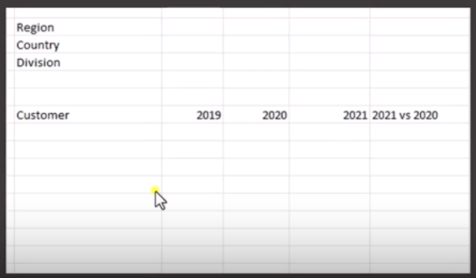
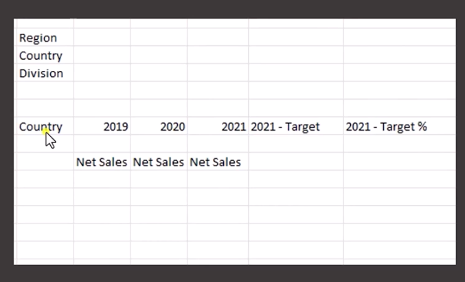

# 📊 Sales Analytics Project – AtliQ Hardware

## 📌 Project Overview
This project analyzes sales performance of **AtliQ Hardware**, a hardware company with customers such as **Croma, Flipkart, and Amazon**.  
The solution was built using **Excel (Power Query, Power Pivot, DAX, Conditional Formatting)** to generate insightful dashboards.

---

## 🔧 Tools & Techniques Used
- **Power Query** → Data cleaning & transformation (promoting headers, changing datatypes, creating fiscal year logic).  
- **Power Pivot & Data Model** → Star schema modeling with Fact & Dimension tables.  
- **DAX & Measures** → Net Sales calculations, YOY growth, Target achievement.  
- **Conditional Formatting** → Data bars, 3-color scales for performance tracking.  

---

## 📂 Data Model
- **Fact Table:** Sales  
- **Dimension Tables:** Customer, Product, Market, Date  
- Created a **Date Dimension Table** in Power Query with fiscal year logic:  

```DAX
Date.Year(Date.AddMonths([Date],4))
```

*(Fiscal year: September → August)*  

- Implemented **Star Schema** with relationships in Data Model.  

---

## 📈 Reports & Insights

### 1. Customer Performance Report
- Measures:  
  - `2019 Net Sales`  
  - `2020 Net Sales`  
  - `2021 Net Sales`  
  - `YOY Growth (20 vs 21)` → `(21 NS - 20 NS) / 20 NS`  
- Added slicers for **Region, Market, Division**.  
- Applied conditional formatting:  
  - **3-color scale** for Net Sales (2019–2021).  
  - **Data bars** for YOY % change.  

### 2. Market Performance vs Target
- Imported Market Target Table with **2019, 2020, 2021, and 21–Target %**.  
- Joined into data model & modified relationships.  
- Replaced `20 vs 21 %` with `2021–Target` and `% Achievement vs Target`.  

---

## 🖼️ Mockup Views
### Customer Performance Dashboard


### Market Performance vs Target Dashboard


---

## 🚀 Key Learnings
- Data modeling with **Star Schema & Snowflake Schema**.  
- Creating **Fiscal Year-based analysis** in Power Query.  
- Using **DAX measures** for dynamic YOY and Target KPIs.  
- Building interactive Excel dashboards with slicers & formatting.  
